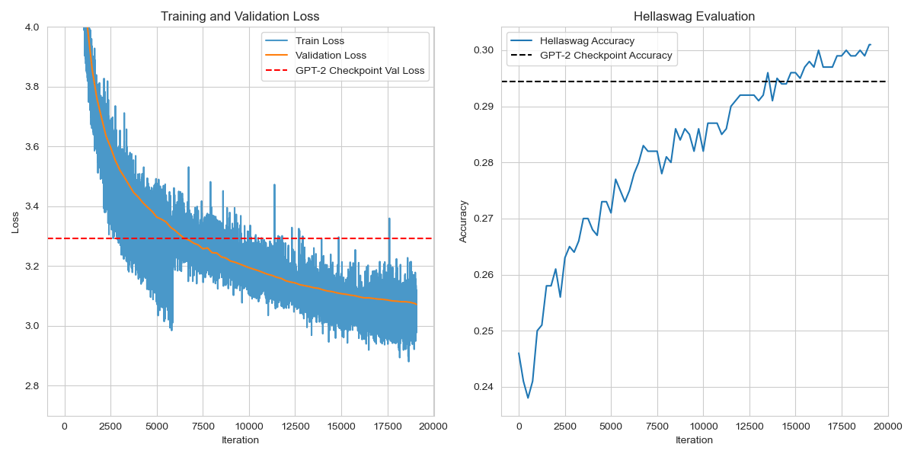

# GPT From Scratch

Scalable GPT implementation using Distributed Data Parallel for efficient, multi-GPU training of transformer models.

## Overview

**GPT From Scratch** is an open-source implementation of a GPT-style transformer model, designed for scalability and efficiency. By leveraging Distributed Data Parallel (DDP) training, this project allows for efficient multi-GPU training, making it easier to train large-scale models on extensive datasets.

## Features

- Built from scratch GPT-style transformer model
- Efficient multi-GPU training using PyTorch's Distributed Data Parallel (DDP)
- Scalable and optimized for large datasets
- Easy-to-use interface for training and inference

## Results
Our model outperforms the GPT-2 checkpoint values on the HellaSwag benchmark, demonstrating the effectiveness of our implementation.

### Model Output
Model Before Training: 
```
On a clear day indis DNSヘラ ignore Happ Ce Croatian mugVAavorable303 wayomb prom bartender surmia pass standingotoshanMore intensely Lent loaf
```
Model After Training: 
```
On a clear day, our community is growing and we are enjoying the beauty and tranquility of our natural surroundings. While it may not be a
```

### Training Loss and HellaSwag Evaluation

Here is a figure showing the training/validation loss and model's performance on the HellaSwag benchmark:




## Installation

### Install from PyPI

To install the package from PyPI, run the following command:

```bash
pip install GPT-from-scratch
```

### Install from Github

To install the latest version directly from GitHub, use:

```bash
pip install git+https://github.com/MatinKhajavi/GPT-from-scratch.git
```

## Usage


## License

This project is licensed under the MIT License.

